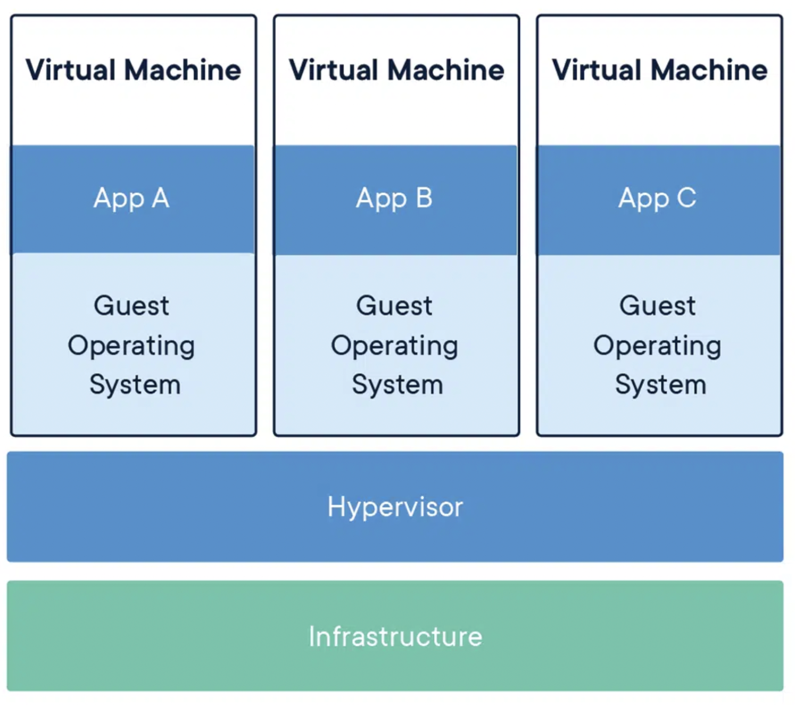
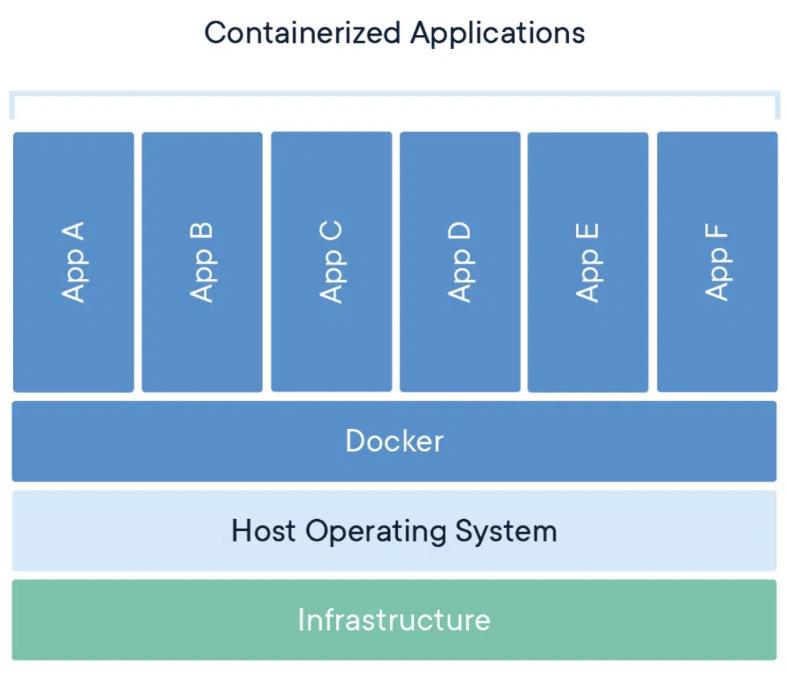
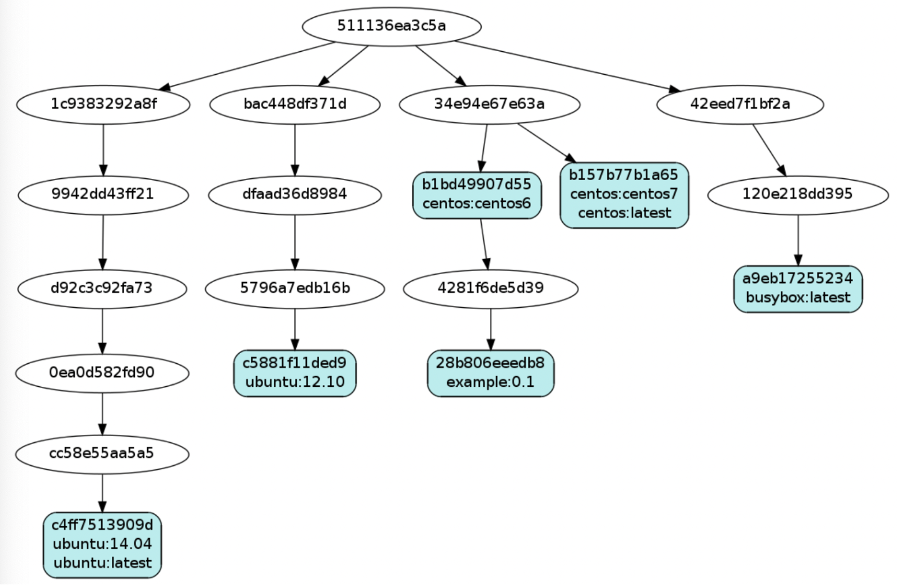

# 클라우드 환경

## 도커란?

도커(Docker)는 **컨테이너 기반의 가상화 플랫폼**으로,  
응용 프로그램과 종속된 Application과 Bin/Lib 등을 컨테이너로 패키징하여 실행하는 기술입니다.

### 도커 사용 장점
1. **서로 다른 환경에서도 일관된 응용 프로그램 실행**
2. **개발 환경과 OS 환경 간의 차이로 인한 문제 발생률 저하**
3. **OS와 서비스 운영 환경 분리로 가볍고, 어디서든 실행 가능**
4. **서비스 운영 환경 관리가 용이**
   - 서비스 운영 환경을 이미지로 생성
   - 이미지 중앙 관리로 체계적 배포와 관리
   - 이미지 생성 설정도 파일로 이뤄져, 버전 관리 활용 가능

---

### 가상 머신




- **물리적인 컴퓨터 위에서 또 다른 “가상의 컴퓨터”를 만들어 실행하는 기술**
- CPU, 메모리, 디스크, 네트워크 카드 같은 하드웨어 자원을 **가상화(virtualization)** 해서 여러 VM을 독립적으로 운영
- VM 내부에는 독립적인 운영체제를 설치 → 실제 컴퓨터처럼 사용 가능
- 예: UTM, VirtualBox

---

### Docker



- 하드웨어를 가상화하지 않고, **호스트 커널을 공유**
- **Guest OS 없음** → 호스트 OS 커널 그대로 활용
- **네임스페이스(namespace), cgroups(control groups)** 를 이용해 격리/리소스 제한 구현
- 독립적인 User Space 제공

---

### 컨테이너 OS 공유의 원리
- 컨테이너가 OS를 공유한다는 것은 **커널을 함께 쓴다**는 의미
- MacOS 위에서 Docker Desktop 실행 시, 내부적으로 Linux 커널을 가진 경량 VM 구동
- 모든 컨테이너는 Linux 커널의 **시스템 콜(syscall)** 을 사용
- 각 컨테이너는 독립적인 **파일 시스템, 네트워크, PID** 공간을 가짐
- Application + Bin/Lib → **컨테이너 단위 패키징**으로 배포 효율성 극대화

---

### 가상머신 vs Docker
- **가상머신 단점**
  - 각 VM마다 독립적인 OS 필요
  - CPU/메모리/디스크를 하드웨어 수준에서 분리 → 무겁고 느림
- **Docker 장점**
  - 커널 공유 → 가볍고 빠름
  - 이미지 단위 배포 → 손쉽게 찍어내기 가능

---

## Docker 이미지 & 컨테이너

### Docker 이미지


- 애플리케이션 실행에 필요한 요소를 하나의 계층적 파일시스템으로 패키징한 스냅샷
- 리눅스 기반 최소 OS + 추가 프로그램
- 계층 구조(Layer)로 저장 → **Base 이미지** 위에 변경 사항만 쌓음
- 특징
  - 저장소(Docker Hub 등)에 올려 공유 가능
  - **Write Once, Run Anywhere** 철학과 유사

### Docker 컨테이너

- 이미지를 실행한 상태 = 컨테이너
- 하나의 이미지에서 여러 컨테이너 생성 가능
- OS 관점: 이미지 = 실행 파일, 컨테이너 = 실행 중인 프로세스

---

## Deploy

### 배포란?
> 💡 개발된 소프트웨어를 사용자 환경에 전달하고 실행 가능하게 만드는 과정

- 개발 → 테스트 → 운영 환경 반영의 최종 단계

### 배포 흐름
1. **개발 환경(Local)**  
   - 코드 작성, 단위 테스트 수행
2. **빌드(Build)**  
   - 실행 가능한 산출물 생성 (JAR, WAR, Docker Image 등)
3. **테스트 환경(Test/Staging)**  
   - 운영과 유사한 환경에서 QA 수행
4. **운영 환경(Production)**  
   - 실제 사용자에게 서비스 제공 (AWS EC2, K8s, App Store 등)

### 배포 파일
- **JAR (Java ARchive)**
  - Spring Boot 기본 산출물
  - 내장 Tomcat/Jetty 포함 → 단독 실행 가능
  - `java -jar app.jar`
- **WAR (Web Application Archive)**
  - 독립 실행 불가, WAS(Tomcat 등)에 배포 필요
  - 레거시 환경에서 주로 사용
- **Docker Image**
  - 애플리케이션 + 실행환경(OS, JDK 등)을 함께 패키징
  - JAR을 포함하여 실행하는 경우가 많음

### 배포 방식
- **수동 배포**: JAR/WAR 직접 복사 후 실행
- **자동 배포**: 스크립트화, CI/CD 파이프라인 활용

---

## 서버란?

- **클라이언트 요청을 받아 서비스/데이터를 제공하는 시스템**
- 실제 장비(물리 서버) 또는 소프트웨어 프로세스를 지칭하기도 함

### 서버의 형태
- **물리 서버(On-premise)**: 데이터센터 내 장비
- **가상 서버(Virtual Server)**: 물리 서버를 가상화해 분리 (예: VMware, EC2)
- **클라우드 서버(Cloud Server)**: 클라우드 사업자가 제공하는 서버 (AWS, GCP, Azure)

### 서버의 종류
- **웹 서버**: Nginx, Apache
- **애플리케이션 서버**: Spring Boot, Flask, Tomcat
- **DB 서버**: MySQL, PostgreSQL
- **파일 서버**: NAS, FTP
- **캐시 서버**: Redis, Memcached
- **프록시 서버**: Proxy, Bastion

---

## Docker Compose


### 특징
- 여러 컨테이너를 하나의 서비스 묶음으로 정의/실행
- `docker-compose.yml` 기반
- 한 번의 명령(`docker compose up`)으로 전체 실행

### docker-compose.yml
- 서비스 스택 정의 파일
- 서비스 간 독립 네트워크 자동 생성
- 컨테이너 간 서비스명(hostname)으로 통신 가능
- `.env` 파일 연동 → 환경변수 관리
- `depends_on` → 실행 순서 지정
- 볼륨 관리 → DB 데이터 유지

### 단점
- 단일 서버 배포 전용
- MSA, 멀티 서버 환경은 Kubernetes, Swarm, Nomad 등 필요

---

## Cloud Native

> 💡 엔지니어가 프로그래밍하고, 빌드 → 직접 시스템에 배포 및 운영  
> 사용자와 끊임없이 상호작용하며 개선하는 **개발·운영 문화**

- **Dev + Ops**
- **IaC(Infrastructure as Code)**
- **지속적인 통합 및 배포(CI/CD)**

---

## CI/CD

### CI (Continuous Integration)
- 코드 컴파일, 테스트, 패키징 자동화
- 작은 단위로 자주 통합/빌드 → 품질 향상

```text
1. 개발자가 git에 Commit
2. Jenkins가 Build → Test → Package
3. CI 통과 시 CD 가능
```

###  CD (Continuous Deployment)
- CI 결과물을 실제 서버에 자동 배포
- Jenkins를 선택한 이유
    - 오픈소스 (MIT License, 무료, 제한 없음)
    - 플러그인 다양 (SCM, 빌드툴, 배포도구 연동 쉬움)
    - 자체 호스팅 최적화 (온프레미스, 클라우드, Docker 등 어디서나)
    - 파이프라인 정의/시각화 (Blue Ocean, Stage View 지원)
- Jenkins 설정
    - Docker 이미지(jenkins/jenkins:lts-jdk17)로 실행
    - 의존성 포함 → 환경 일관성 확보
    - 특정 태그 지정 → 모든 환경 동일 버전 실행
    - 볼륨 마운트 → 설정/이력 유지
    - -d, --restart=on-failure → 자동 복구

### CI/CD Flow

```text
🔁 1. Continuous Integration (CI)
Git      : 개발자가 코드 작성 후 Commit & Push
Jenkins  : 변경사항 감지 → 빌드/정적분석 수행
SonarQube: 코드 품질 분석 후 Jenkins로 결과 반환

🚀 2. Continuous Deployment (CD)
Ansible  : Docker 이미지 빌드 & Push 자동화
Registry : Docker Hub/ECR 등 저장소에 업로드
K8s      : 이미지 Pull → 클러스터에 배포
         : 롤링 업데이트로 무중단 배포
```