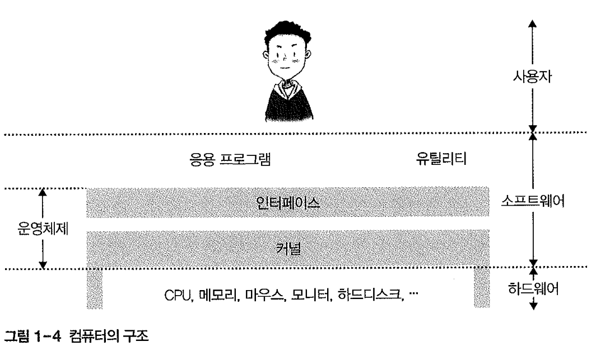
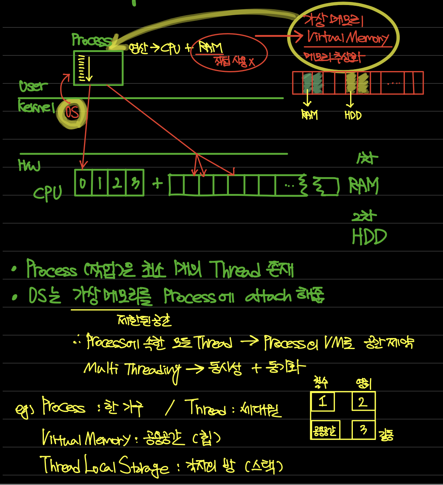
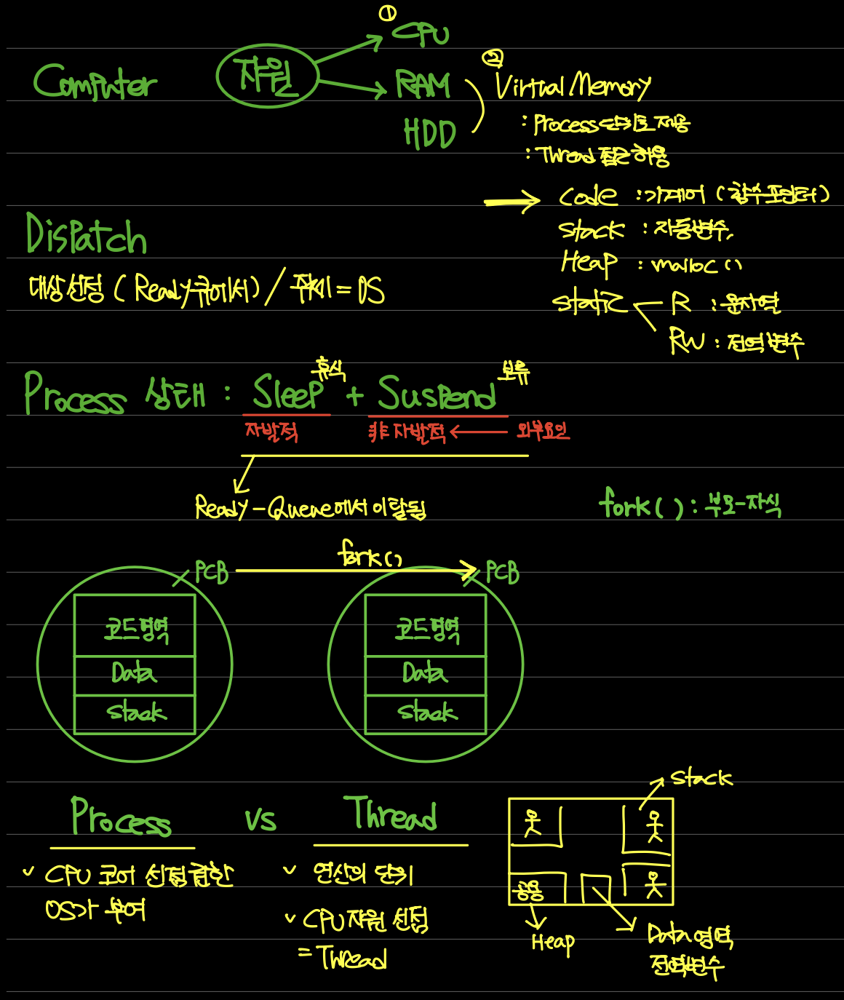

# 운영체제

### 운영체제

- 운영체제
    - 모든 소프트웨어 위에 존재하는 최고의 소프트웨어
    - 잘못된 동작으로 컴퓨터가 망가지는 것을 방지하기 위해 컴퓨터 전체를 관리하고 운영
    - 응용 프로그램과 사용자에게서 모든 컴퓨터 자원을 숨긴다
        
        : User에게서 컴퓨터 자원을 숨기는 대신 자원을 이용할 수 있는 여러 방법 제공
        
        - 인터페이스
            
            : 사용자가 컴퓨터를 사용할 수 있도록 해주고, 결과를 알려주는 장치
            
    - 컴퓨터 자원을 효율적으로 관리하는 소프트웨어
        
        → 컴퓨터에 있는 하드웨어(자원)를 조정하고 관리
        
        - 응용 프로그램은 특정 목적을 위해 존재
    - 펌웨어(Firmware)
        - SW/HW의 특성을 모두 갖춘 형태로 운영

    

    - 운영체제는 컴퓨터 자원을 관리하는 소프트웨어, 전원을 켜면 가장 먼저 실행
    - 커널과 인터페이스로 분리
        - 커널
            
            : 운영체제의 핵심 기능
            
            : 모든 컴퓨터 자원 관리 → User나 응용 프로그램은 OS(커널) 통해서만 컴퓨터 자원에 접근 가능
            
        - 인터페이스
            
            : 인터페이스를 이용, 커널에 명령 → 인터페이스가 결과 전달
            
    - Application Software(응용 프로그램)
        - 컴퓨터 자원 사용하기 위해서는 OS가 제공하는 함수 형태의 인터페이스 이용
        - UI (사용자 인터페이스)
        - GUI
            
            : 마우스, 손가락 터치로 작업 처리

    - 발전 과정
        - 일괄작업 시스템 -> 대화형 시스템 -> 시분할 시스템 -> 실시간 시스템
    
    - 구성
        - 커널
        - 인터페이스
        - 운영체제

### 컴퓨터의 기본 구성

- 하드웨어의 구성
    - 컴퓨터
        - 폰 노이만 구조 : 모든 프로그램은 메모리에 올라와야 실행 가능
    - CPU / 메모리
    - 입출력 장치
    - 보조저장장치
    - 메인보드

- CPU와 메모리
    - CPU
        - ALU , ControlUnit, Register로 구성
    - Register
        - CPU는 필요한 데이터를 메모리에서 가져와 레지스터에 저장 
        - 사용자 가시 레지스터 (데이터 레지스터, 주소 레지스터)
        - 사용자 불가시 레지스터 ( 프로그램 카운터, 명령어 레지스터, 메모리 버퍼 레지스터)
    - 버스의 종류
        - 제어버스
            : 제어장치와 연결된 버스
            : 다음에 어떤 작업할 지 지시하는 제어 신호 통신, 양방향
        - 주소버스
            : 메모리 주소 레지스터와 연결된 버스
            : 데이터를 읽거나 쓸 때 메모리나 주변 장치에 위치 정보를 보내기 위해 사용, 단방향
        - 데이터 버스
            : 메모리 버퍼 레지스터와 연결
            : 데이터의 이동이 양방향

### 프로세스

- 프로세스
    - 프로그램 : 저장장치에 저장된 정적인 상태
    - 프로세스 : 실행을 위해 메모리에 올라온 동적인 상태 (OS의 하나의 작업 단위)
    - 프로그램이 실행되면 프로세스

- 프로세스의 상태
    - 일괄 작업 시스템
        - 프로세스 생성 후 CPU 획득 -> 작업 마치면 종료
    - 시분할 시스템
        - 생성 상태 -> 준비 상태 -> 실행 상태 -> 완료 상태
        - 대기 상태도 존재
            : 입출력을 요구한 프로세스가 입출력이 완료될 때까지 기다리는 상태
            : 프로세스가 대기상태로 옮겨짐 → 준비 상태 프로세스 중 하나가 실행 상태로 이동
        - 휴식 상태와 보류 상태
            : 프로세스가 메모리에서 쫓겨난 상태
            : 스왑 영역 (메모리에서 쫓겨난 데이터가 임시로 보관되는 곳)

- 컨텍스트 스위칭 (문맥교환)
    - CPU를 차지하던 프로세스가 나가고, 새로운 프로세스를 받아들이는 작업
        → 두 PCB 내용이 변경 (두 프로세스의 PCB 교환)
    - 스케줄러 : 프로세스를 바꿔줌
    - 문맥교환 상황
    - 한 프로세스가 자신에게 주어진 시간 다 사용
    - 인터럽트가 걸렸을 때도 발생
    : 경계 레지스터의 범위를 벗어나는 것 → 인터럽트 발생

### 스레드
- 프로세스 작업 과정
    - OS → (Code+Data) → Memory → PCB → Memory 영역 확보 → ReadyQue에 큐잉
        
        → Process 생성 → CPU Scheduler가 CPU에 전달 → CPU가 작업 수행
        
    - Thread
        - CPU 스케줄러가 전달하는 일
        - CPU 입장의 작업 단위 (Process = OS 입장의 작업 단위)
        - 프로세스의 코드에 정의된 절차에 따라 CPU에 작업 요청을 하는 실행 단위

- 작업의 크기
    - Job(처리) > Task(프로세스) > Operation(스레드)
    - 프로세스 여러개 묶으면 일괄 작업 (배치처리)

- 프로세스 VS 스레드
    - 프로세스끼리는 약연결
    - 스레드끼리는 강연결

- 멀티태스크
    - 여러 개의 프로세스로 구성
    - A 프로세스가 비정상적으로 종료되어도 B 프로세스는 정상 작동
        - IPC(프로세스 간 통신)를 이용해 서로 데이터를 주고받음

- 멀티스레드
    - 하나의 프로세스에서 여러 스레드들이 동시에 작업 진행
        - 코어의 수와는 별개 → 스위칭

- 멀티태스킹
    - OS가 CPU에 작업 분배할 때 시간을 잘게 나눠 배분 = 시분할 시스템
        
        → OS가 CPU에 전달하는 작업은 스레드 (프로세스 X)
        
- 멀티 프로세싱
    - CPU를 여러 개 사용 → 여러 개의 스레드를 동시에 처리하는 작업 환경
        - 컴퓨터 하나에 CPU가 여러 개 설치되어 동시에 작동
        - CPU 내 여러 개의 코어에 스레드 배정 → 동시에 작동하는 것도 멀티프로세싱

- CPU 멀티스레드
    - 스레드를 잘개 쪼개 동시에 처리하는 명령어 병렬 처리 기법
        = 하이퍼 스레드
    - 프로세스를 작은 단위의 스레드로 분할하여 운영 → 멀티스레드
    - CPU에서 여러 스레드를 동시에 처리하는 것 → CPU 멀티스레드

### 멀티스레드의 장단점

- 장점
    - 프로세스 내 공유가 가능한 부분 제외
    - 실행과 관련된 부분을 스레드로 나눠 관리 → 자원의 중복 사용 회피
    - 예시
        - 비디오 플레이어의 입출력 & 재생 → 멀티스레드로 구현
        - 입출력 스레드는 대기 상태
        - 재생 스레드는 실행 상태
    - 결과
        - 응답성 향상
        - 자원 공유
        - 효율성 향상
        - 다중 CPU 지원

- 단점
    - 모든 스레드가 자원 공유        
        → 한 스레드에 문제 발생시 전체 프로세스에 영향

# 동적 할당 영역과 시스템 호출

### 프로세스의 동적 할당 영역

- 프로세스 상세 구조
    - 코드 영역
        - 프로그램의 본체 존재
    - 데이터 영역
        - 프로그램이 사용하려고 정의한 변수와 데이터 존재
            1. 전역 변수
            2. 정적 변수(static)
            3. 초기화되지 않은 변수
        - 코드 영역과 데이터 영역은 프로세스 실행 전 위치와 크기가 결정
            
            → 정적 할당 영역
            
    - 스택 영역
        - 호출 함수 종료시 호출 전 코드로 돌아와야 하는데 돌아올 메모리 주소 저장
        - 변수 사용 범위에 영향을 미치는 영역 구현에 사용
            1. 지역 변수 (함수 안에서 선언한 변수)
            2. 함수 호출 정보
    - 힙 영역
        - 동적 할당 변수 → malloc(), new()
        - 동적 객체 → 객체, 리스트, 배열

- 힙 파편화
    - 메모리 전체 크기는 충분한데, 중간중간 틈이 발생 → 새로운 메모리 할당 X
    - 종류
        - 외부 파편화 : 힙 메모리 공간은 있으나, 연속된 메모리 공간이 부족
            
            → 메모리 풀, 컴팩션(Java GC)
            
        - 내부 파편화 : 실제 요청 메모리 공간보다, 남는 메모리 공간 발생
    - 발생 원인
        - 힙의 유연성과 확장성은 파편화의 대가
            1. 정해지지 않은 시점에 정해지지 않은 크기의 메모리를 할당할 수 있어야 함
            2. 유연성 제공의 대가로 파편화 발생
    - 힙이 필수적인 이유
        1. 복잡한 자료구조 가능
        2. 동적 생명 주기 제어 가능

### CPU 스케줄링

- 선점형 스케줄링 , 비선점형 스케줄링

- 프로세스 우선순위
    - 커널 프로세스 > 일반 프로세스

- 스케줄링 알고리즘
    - 비선점형 알고리즘
        - FCFS
        - SJF
        - HRN
    - 선점형 알고리즘
        - RR
        - SRT
        - MLQ
        - MLFQ
    - 둘다 가능
        - 우선순위 알고리즘

- 프로세스 간 통신
    - 프로세스 혹은 스레드는 독립적으로 실행
    - 협업하거나 데이터를 병렬로 처리하기 위해서는 데이터를 주고받아야 함
    - 스레드는 하나의 프로세스 내에서 자원을 공유하는 실행 단위
        → 스레드 간 통신은 문제 X
        
    - 서로 다른 프로세스는 사용 메모리 영역이 달라 공유된 메모리를 통해 통신이 어려움
        → 프로세스 간 통신 (IPC) 이용

- 통신 방향에 따른 분류
    - 양방향 통신
        - 소켓
    - 반양방향 통신
        - 양 방향이지만, 동시전송은 불가능
        - 특정 시점에 한쪽 방향으로만 전송 가능
        - 무전기
    - 단방향 통신
        - 한쪽 방향으로만 데이터 전송 가능
        - 공유 메모리나 공유 파일을 이용한 통신
        - 파이프를 이용한 통신
        - 양방향 통신 구현 방법
            → 공유 메모리 2개 or 파이프 2개 사용
            

- 통신 구현 방식에 따른 분류
    - 바쁜 대기
        - Polling 방식
    - 바쁜 대기 해결 방법
        - 데이터가 도착했음을 알려주는 동기화 사용
            → 바쁜 대기를 하지 않아도 데이터 도착 시 OS가 알아서 알려줌
        - 동기화 기능 유무에 따라 대기가 있는 통신(동기화 통신), 대기가 없는 통신으로 구분(비동기화 통신)

### 공유 자원에 대한 접근

- 공유 자원
    - 여러 프로세스가 공동으로 이용하는 변수,메모리,파일 등
    - 경쟁 조건
        - 2개 이상의 프로세스가 공유 자원을 병행해서 읽거나 쓰는 상황

- 임계 구역
    - 공유 자원 접근 순서에 따라 실행 결과가 달라지는 프로그램의 영역
    - 각 프로세스가 전역 변수를 사용하는 부분
    - 한 프로세스가 임계구역에 들어가면 → 타 프로세스가 나와야 접근 가능

### 임계구역 문제 해결 조건

- 상호 배제
    - 한 프로세스가 임계구역에 들어가면 다른 프로세스는 임계 구역에 들어갈 수 없음
    - 임계구역 내에는 한 번에 하나의 프로세스만 있어야 함

- 한정 대기
    - 어떤 프로세스도 임계구역에 진입하지 못하여 무한 대기하지 않아야 한다

- 진행의 융통성
    - A,B의 작업 속도와 관계 없이 공유 구역이 비어있으면 언제든 사용 가능해야함
    - 한 프로세스가 다른 프로세스의 진행을 방해해서는 안된다

